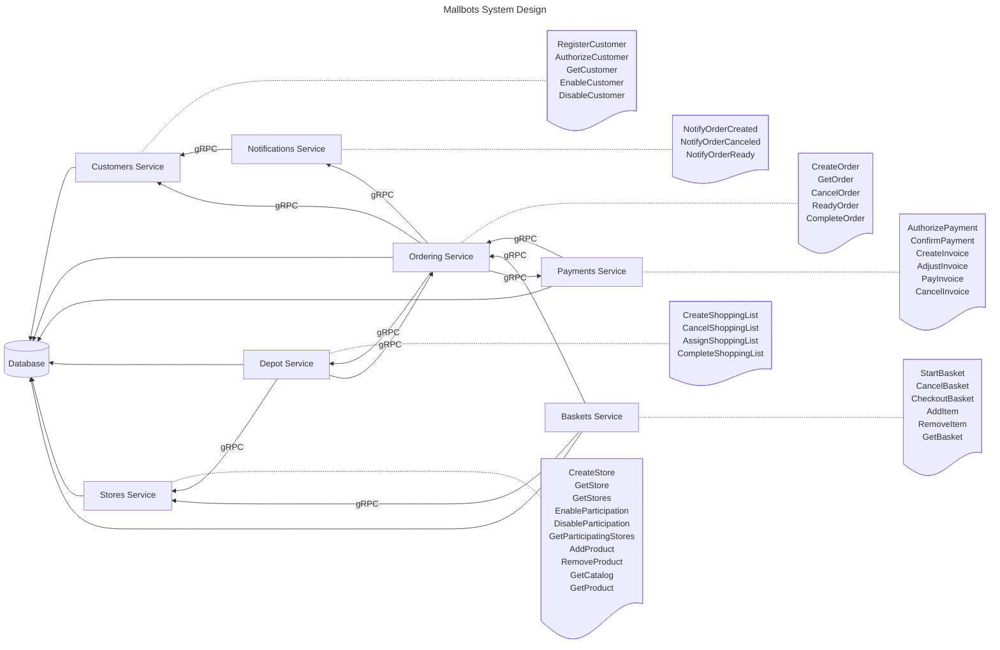

# MallBots

###### ⚔️ References

# Postman Collections

- [gRPC](https://gold-shuttle-395606.postman.co/workspace/My-Workspace~e9564e49-df76-48b9-8f40-1c74ee320241/collection/687cdfafaff3c5780e7dbdd7?action=share&creator=10413281&active-environment=10413281-37d0952d-6a07-443b-a8f3-83805f295a77)
- [REST](https://gold-shuttle-395606.postman.co/workspace/My-Workspace~e9564e49-df76-48b9-8f40-1c74ee320241/collection/10413281-2748aa7f-effe-4b38-8fd4-a68d044657c0?action=share&source=copy-link&creator=10413281)

- Swagger UI: [http://localhost:8080/](http://localhost:8080/)
- HTTP service: [http://localhost:8080/](http://localhost:8080/)
- gRPC service: [grpc://127.0.0.1:8085](grpc://127.0.0.1:8085)

# System Design

